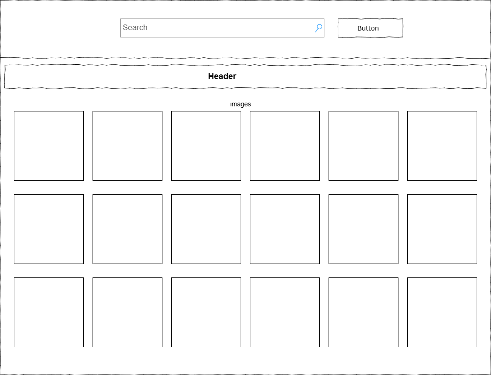
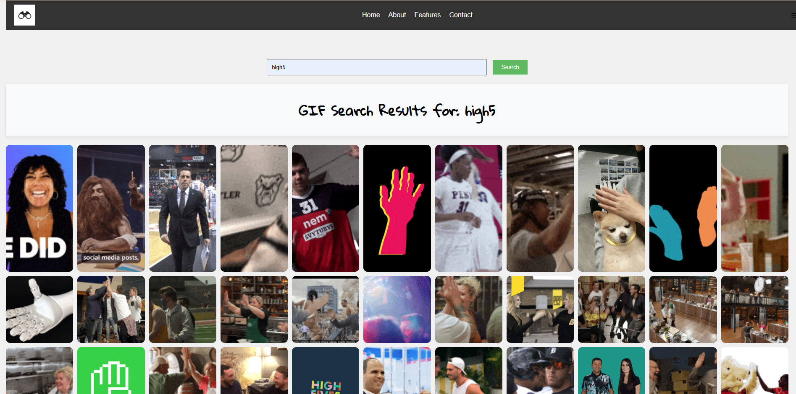

# Website With Search Engine

## Kola Oyedele

## Overview
This project is intended to create a website with a search engine that can be used to search for GIF images by keywords.
The images are then displayed in three rows and a header above the images. The header indicates the keyword used to search for the images.

## Details
The web page contains a navigation bar at the top of the page with a logo clickable to homepage. It also contains other navigational elements that link to other pages.
Below the navigation bar is a search bar and a search button. A keyword is entered into the search bar and the the search button is clicked to initiate the search.
If images are returned from the search, a header is displayed is displayed below the search bar to indicate the keyword used to search for the images, and the returned images are displayed below the header in rows.

## User Story

### User Story 1: Search for GIFs
**As a** user,  
**I want to** be able to enter a keyword and search for related GIFs,  
**So that** I can find and view GIFs that interest me or are relevant to my current needs.

- **Acceptance Criteria:**
  - There must be an input field for keywords.
  - A search button should trigger the API call with the entered keyword.
  - The system should handle basic input validation (e.g., not allowing empty searches).
  - Results should be displayed after a short delay post-search.

### User Story 2: Browse GIFs in a Grid Layout
**As a** user,  
**I want to** see search results displayed in a grid layout,  
**So that** I can easily scan through multiple GIFs at once without needing to scroll horizontally.

- **Acceptance Criteria:**
  - GIFs should be displayed in a responsive grid that adjusts to screen size.
  - Each GIF thumbnail should be clickable, possibly leading to a larger view or download option.
  - The grid should be optimized for both desktop and mobile, ensuring visibility and usability on smaller screens.

### User Story 3: Responsive Design for Mobile Users
**As a** mobile user,  
**I want** all elements of the website, including search functionality and image display, to be easily accessible and visually appealing on my device,  
**So that** I can use the site effectively on-the-go without needing to switch to a desktop.

- **Acceptance Criteria:**
  - The search form should be easily accessible with touch inputs, possibly with larger buttons or areas for tapping.
  - The layout should automatically adjust for smaller screens, potentially changing from a horizontal input form to a vertically stacked one.
  - Images in the grid should be touch-friendly, with enough space to tap without accidentally selecting adjacent images.

These stories guide the development process by focusing on user needs, helping to ensure the final product is both functional and user-friendly across different devices.

## Wireframe

## Technologies Used
**html**
**css**
**js**

## Ideas for future improvement
1. Render API result in pages
2. Add an input for maximum number of GIFs to return
3. Add membership functionality